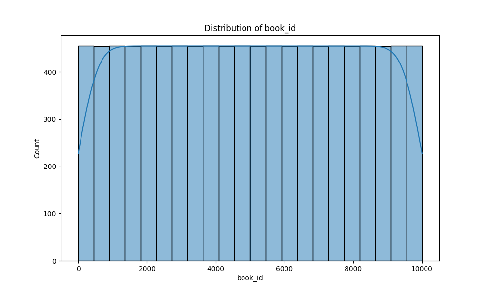
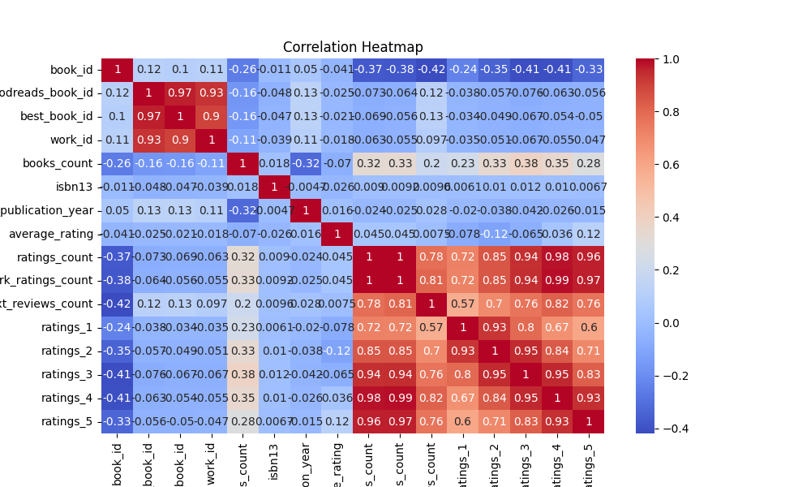

# Automated Data Analysis Report

### Narrative Analysis of Book Dataset

This analysis delves into a dataset comprising 10,000 books, capturing various attributes such as book IDs, authors, publication years, ratings, and more. The insights derived from the data reveal significant trends, outliers, and potential use cases that could inform various stakeholders in the publishing and literary communities.

#### Key Trends

1. **Authors and Popularity**:
   - The dataset features 4,664 unique authors, with Stephen King being the most prolific, appearing 60 times. This suggests that certain authors maintain a strong presence in the literary space, potentially indicating a loyal readership or prolific output. Understanding author popularity can guide publishers in their marketing strategies and help readers discover new works.

2. **Publication Year Distribution**:
   - The average original publication year is 1981, with a standard deviation of approximately 152 years, indicating a wide range of publication dates, including titles dating back to as early as 1750. The concentration of books published post-2000 suggests a trend towards modern literature. This can inform libraries and bookstores about the types of books they should stock to meet contemporary reader interests.

3. **Average Ratings and Popularity**:
   - The average rating across all books is approximately 4.00, with a maximum of 4.82. This indicates a generally favorable reception among readers. The ratings distribution (1 to 5 stars) shows that the majority of ratings lean towards 4 and 5 stars, illustrating that readers tend to favor higher-quality literature. This trend may be leveraged by publishers to promote well-rated books more aggressively.

4. **Ratings Count and Engagement**:
   - The average ratings count is about 54,001, with a maximum of over 4.78 million ratings for a single work. This highlights significant reader engagement with certain titles, suggesting that popular books can generate substantial discussion and review activity. Publishers and authors could utilize this information to foster community engagement through book clubs or online discussions.

#### Outliers

1. **Publications with Extreme Ratings**:
   - Certain books have garnered exceptionally high ratings counts, with one title reaching nearly 4.78 million ratings. This could represent a bestseller or a book that has achieved cultural significance, meriting further investigation into what makes such titles resonate with readers.

2. **Books with Limited Reviews**:
   - The minimum ratings count is 2,716, while the maximum is 4,780,653. This discrepancy

