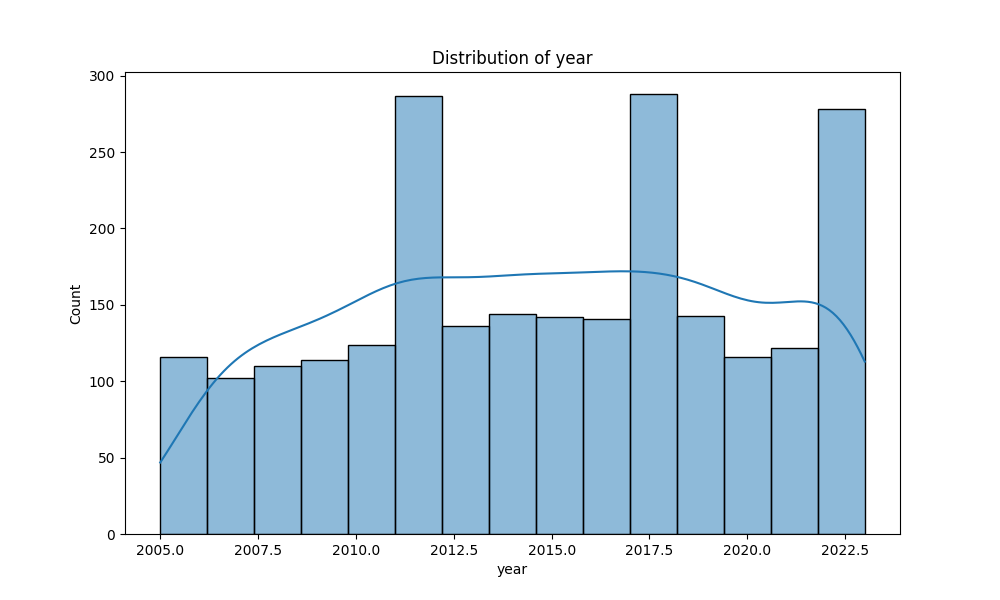
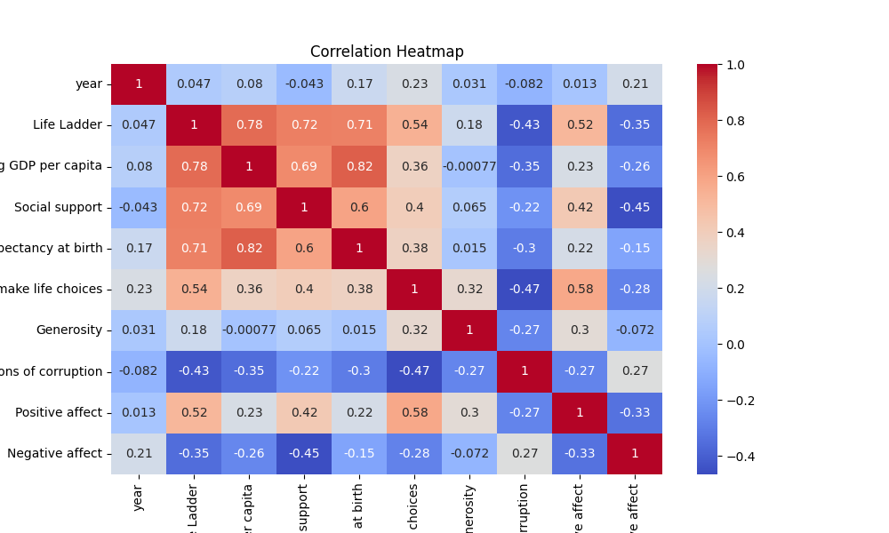

# Automated Data Analysis Report

### Narrative Analysis of the Dataset

The dataset under examination encompasses multiple dimensions of well-being across various countries over time, represented by several key indicators. These indicators include subjective assessments of life satisfaction (Life Ladder), economic conditions (Log GDP per capita), social factors (Social support), health metrics (Healthy life expectancy at birth), personal freedoms, generosity, perceptions of corruption, and emotional states (Positive and Negative affect). 

#### Key Trends

1. **Life Ladder and Well-Being**: The mean Life Ladder score across the dataset is approximately 5.48, indicating a moderate level of subjective well-being among the countries represented. The distribution, with a minimum of 1.281 and a maximum of 8.019, suggests significant variability, with some countries experiencing very low life satisfaction.

2. **Economic Indicators**: The Log GDP per capita averages around 9.40, reflecting relatively strong economic conditions, though the range (from 5.527 to 11.676) shows stark contrasts between wealthier and poorer nations. This disparity may correlate with life satisfaction levels, which are often higher in wealthier countries.

3. **Social Support and Freedom**: The mean values for Social support (0.81) and Freedom to make life choices (0.75) indicate that, on average, people feel a reasonable level of social backing and personal freedom. However, the standard deviations indicate that there are substantial differences among countries, suggesting that some populations may feel isolated or constrained.

4. **Health Metrics**: The average Healthy life expectancy at birth is approximately 63.4 years, with a notable range from 6.72 to 74.6 years. This suggests that while some countries have robust healthcare systems contributing to longevity, others struggle significantly, which likely impacts overall life satisfaction and economic productivity.

5. **Emotional Well-Being**: The dataset shows a mean Positive affect of 0.65 and a Negative affect of 0.27. The relatively high levels of positive emotions suggest a general trend towards happiness, albeit with notable pockets of negativity that could reflect underlying societal issues.

#### Outliers and Anomalies

- **Countries with Extreme Values**: The country with the highest Life Ladder score and the lowest Log GDP per capita may indicate a surprising trend where subjective well-being does not solely depend on economic wealth. Conversely, countries with high GDP but low Life Ladder scores could reveal issues such as social inequality or corruption undermining quality of life.

-

