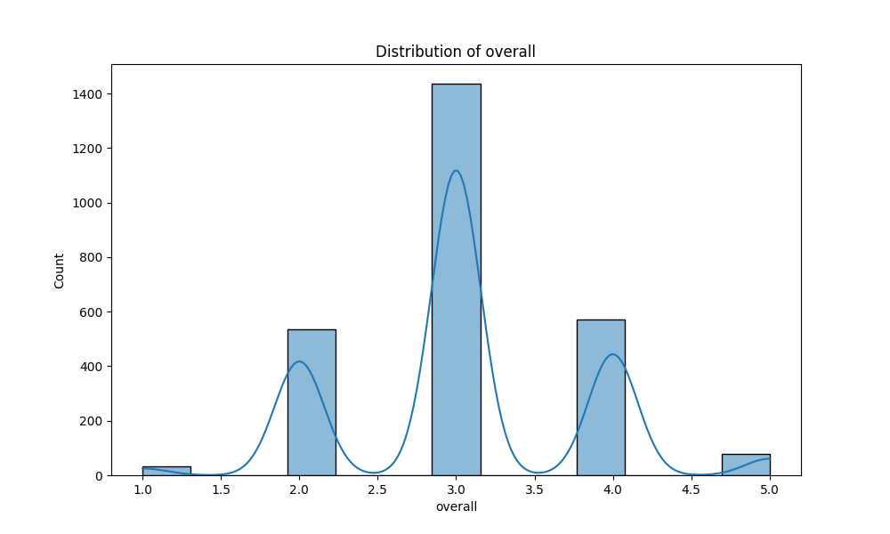
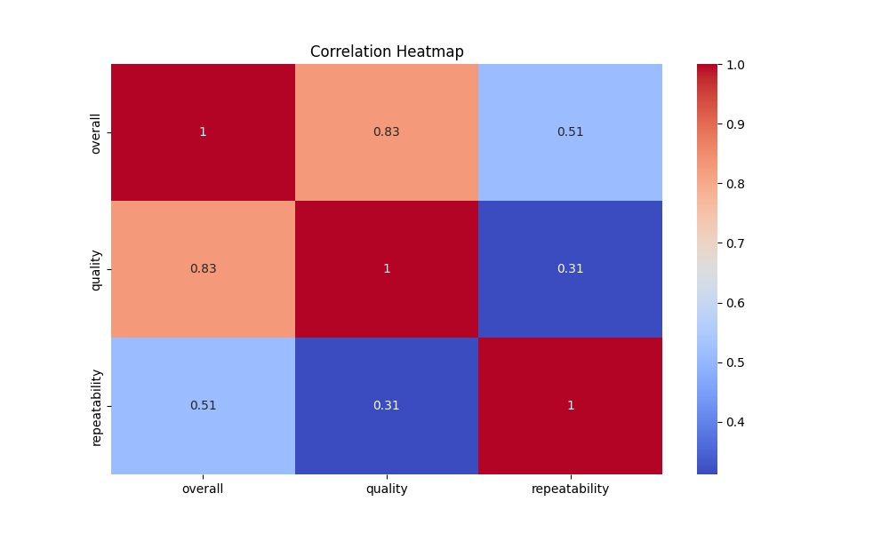

# Automated Data Analysis Report

### Narrative Analysis of the Dataset

The dataset consists of 2,652 entries, capturing various attributes related to films, including their release date, language, type, title, director/actor, and ratings across several metrics. The key columns of interest are 'date', 'language', 'type', 'title', 'by', 'overall', 'quality', and 'repeatability'. 

#### Key Trends

1. **Temporal Distribution**:
   - The dataset spans a significant period, with 'date' entries showing a total of 2,055 unique dates. The most frequently occurring date is '21-May-06', with 8 occurrences. However, the analysis lacks a comprehensive temporal breakdown, making it difficult to discern trends over time (e.g., whether film ratings have improved or declined over decades). 

2. **Language Diversity**:
   - The dataset features 11 unique languages, with 'English' being the most dominant, appearing in 1,306 entries (nearly 49% of the dataset). This suggests a strong inclination towards English-language films, which may reflect either a bias in data collection or a higher prevalence of English content in the film industry.

3. **Film Type**:
   - The majority of entries are classified as 'movies', constituting 2,211 of the total. This indicates a strong focus on feature films as opposed to other types like documentaries or series. 

4. **Title and Creators**:
   - There are 2,312 unique titles, with 'Kanda Naal Mudhal' being the most frequently mentioned (9 times). The dataset also lists 1,528 unique creators, with 'Kiefer Sutherland' being the most referenced (48 times), suggesting he may be a prominent figure in the dataset—potentially as an actor or director.

5. **Rating Metrics**:
   - The ratings for 'overall', 'quality', and 'repeatability' show an interesting distribution:
     - **Overall Rating**: Mean of approximately 3.05, with a standard deviation of 0.76, indicating a central tendency around the mid-point of the rating scale (1-5).
     - **Quality Rating**: Slightly higher mean at 3.21, suggesting that films are perceived as having better quality than overall satisfaction.
     - **Repeatability Rating**: Much lower mean of 1.49, indicating that films are often not seen as repeatable experiences, which may

